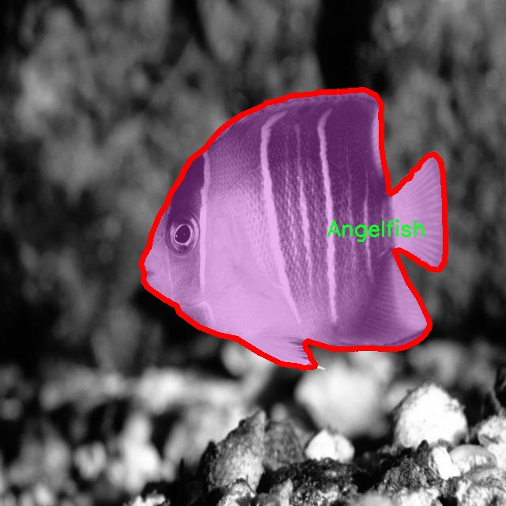

# 海洋生物与珊瑚图像分割系统源码＆数据集分享
 [yolov8-seg-CSwinTransformer＆yolov8-seg-C2f-RFCAConv等50+全套改进创新点发刊_一键训练教程_Web前端展示]

### 1.研究背景与意义

项目参考[ILSVRC ImageNet Large Scale Visual Recognition Challenge](https://gitee.com/YOLOv8_YOLOv11_Segmentation_Studio/projects)

项目来源[AAAI Global Al lnnovation Contest](https://kdocs.cn/l/cszuIiCKVNis)

研究背景与意义

随着全球气候变化和人类活动对海洋生态系统的影响日益加剧，海洋生物的保护与监测变得愈发重要。珊瑚礁作为海洋生态系统的重要组成部分，不仅为众多海洋生物提供栖息地，还在维护海洋生物多样性、保护海岸线和促进渔业可持续发展等方面发挥着关键作用。然而，珊瑚礁的退化和破坏已成为全球面临的重大环境问题之一，尤其是在热带地区。为此，开发高效的监测和评估工具，以便及时识别和保护这些脆弱的生态系统，显得尤为迫切。

近年来，计算机视觉技术的迅猛发展为海洋生物及珊瑚的监测提供了新的解决方案。尤其是基于深度学习的图像分割技术，能够有效地从复杂的图像中提取出目标物体的轮廓和特征，极大地提高了图像分析的准确性和效率。YOLO（You Only Look Once）系列模型因其实时性和高效性，成为目标检测领域的佼佼者。YOLOv8作为该系列的最新版本，进一步提升了模型的性能，尤其在处理复杂背景和多类别目标时展现出优越的能力。因此，基于改进YOLOv8的海洋生物与珊瑚图像分割系统的研究，具有重要的理论和实践意义。

本研究所使用的数据集包含1200幅图像，涵盖44个类别的海洋生物和珊瑚，涵盖了从鱼类到珊瑚的多样性。这些类别包括了如Acanthastrea、Acropora、Angelfish等多种海洋生物，反映了丰富的海洋生态特征。通过对这些图像进行分割和分类，可以实现对海洋生物多样性的全面监测，进而为海洋生态保护提供数据支持。此外，数据集的多样性和复杂性也为模型的训练和评估提供了良好的基础，使得研究成果更具普适性和实用性。

本研究的意义不仅在于技术的创新，更在于其对海洋生态保护的贡献。通过构建高效的图像分割系统，可以实现对珊瑚礁及其生物的实时监测，及时发现生态变化，帮助科研人员和管理者制定科学的保护措施。同时，该系统的应用还可以推动公众对海洋生态保护的关注与参与，提高社会对海洋环境保护的意识。

综上所述，基于改进YOLOv8的海洋生物与珊瑚图像分割系统的研究，不仅是对深度学习技术在生态监测领域应用的探索，更是对海洋生态保护实践的积极响应。通过这一研究，期望能够为海洋生物多样性保护提供新的思路和方法，促进可持续发展目标的实现。

### 2.图片演示


##### 注意：由于此博客编辑较早，上面“2.图片演示”和“3.视频演示”展示的系统图片或者视频可能为老版本，新版本在老版本的基础上升级如下：（实际效果以升级的新版本为准）

  （1）适配了YOLOV8的“目标检测”模型和“实例分割”模型，通过加载相应的权重（.pt）文件即可自适应加载模型。

  （2）支持“图片识别”、“视频识别”、“摄像头实时识别”三种识别模式。

  （3）支持“图片识别”、“视频识别”、“摄像头实时识别”三种识别结果保存导出，解决手动导出（容易卡顿出现爆内存）存在的问题，识别完自动保存结果并导出到tempDir中。

  （4）支持Web前端系统中的标题、背景图等自定义修改，后面提供修改教程。

  另外本项目提供训练的数据集和训练教程,暂不提供权重文件（best.pt）,需要您按照教程进行训练后实现图片演示和Web前端界面演示的效果。

### 3.视频演示

[3.1 视频演示](https://www.bilibili.com/video/BV1rQStY1Esi/)

### 4.数据集信息展示

##### 4.1 本项目数据集详细数据（类别数＆类别名）

nc: 44
names: ['Acanthastrea', 'Acropora', 'Angelfish', 'Batu Coris', 'Bleeker-s Parrotfish', 'Blue Sea Star', 'Blue Tang', 'Bowtie Damselfish', 'Butterflyfish', 'Centropyge vrolikii', 'Checkered Snapper', 'Cleaner Wrasse', 'Coeloseris', 'Euphyllia', 'Favia-', 'Favites', 'Filamentous Blenny', 'Goniastrea', 'Heterocyathus', 'Humbug Dacyllus', 'Humbug Dascyllus', 'Isopora', 'Leptoseris', 'Longnose Butterflyfish', 'Millepora', 'Needlefish', 'Neon Damselfish', 'Pachyseris', 'Palecheek Parrotfis', 'Palecheek Parrotfish', 'Pocillopora', 'Porites', 'Psammocora', 'Sandalolitha', 'Scolopsis bilineata', 'Sea Krait', 'Sea Urchin', 'Sergeant Major Fish', 'Stylophora', 'Trachyphilia', 'Tridacna Crocea', 'Turbinaria', 'Yellowtail Fusilier', 'sidespot goatfish']


##### 4.2 本项目数据集信息介绍

数据集信息展示

在本研究中，我们采用了名为“CLASSIFICATIWON”的数据集，以支持改进YOLOv8-seg的海洋生物与珊瑚图像分割系统的训练。该数据集包含44个类别，涵盖了丰富的海洋生物和珊瑚种类，旨在提高模型在复杂海洋环境中的分割精度和识别能力。通过对这些类别的深入学习，模型将能够更好地识别和分割海洋生态系统中的各种生物，从而为海洋保护和生态研究提供有力的数据支持。

“CLASSIFICATIWON”数据集中的类别包括多种珊瑚和鱼类，例如“Acanthastrea”、“Acropora”、“Angelfish”、“Batu Coris”等。这些类别不仅代表了海洋生物的多样性，还反映了生态系统的复杂性。每一种生物在海洋生态中都扮演着独特的角色，例如，珊瑚是海洋生态系统的基础，提供栖息地和食物来源，而鱼类则在食物链中起着重要的作用。通过对这些生物的精确分割，研究人员可以更好地了解它们的分布、数量及其生态关系，从而为海洋保护和管理提供科学依据。

数据集中包含的鱼类，如“Bleeker-s Parrotfish”、“Blue Tang”、“Butterflyfish”等，都是热带海洋中常见的物种。它们的颜色、形态和行为各异，给模型的训练带来了挑战。通过对这些鱼类的图像进行标注和分割，模型将能够学习到不同物种的特征，从而在实际应用中实现高效的识别和分类。此外，数据集中还包括了多种珊瑚种类，如“Euphyllia”、“Favia-”、“Porites”等，这些珊瑚不仅在视觉上具有显著的差异，而且在生态功能上也各有不同。通过对这些珊瑚的分割，模型将能够识别出健康的珊瑚群落与受损的区域，为生态监测提供重要的信息。

值得注意的是，数据集中的类别数量和多样性为模型的训练提供了丰富的样本，使其能够在不同的环境条件下进行泛化。随着深度学习技术的不断发展，尤其是YOLO系列模型在目标检测和分割任务中的广泛应用，利用“CLASSIFICATIWON”数据集进行训练，将有助于提升模型在海洋生物识别和分割任务中的表现。

总之，“CLASSIFICATIWON”数据集为本研究提供了一个坚实的基础，涵盖了丰富的海洋生物和珊瑚类别。通过对这些数据的有效利用，我们期望能够改进YOLOv8-seg模型的性能，实现对海洋生物的高效分割和识别。这不仅将推动计算机视觉技术在生态研究中的应用，也将为海洋保护和可持续发展提供重要的科学依据。





### 5.全套项目环境部署视频教程（零基础手把手教学）

[5.1 环境部署教程链接（零基础手把手教学）](https://www.bilibili.com/video/BV1jG4Ve4E9t/?vd_source=bc9aec86d164b67a7004b996143742dc)


[5.2 安装Python虚拟环境创建和依赖库安装视频教程链接（零基础手把手教学）](https://www.bilibili.com/video/BV1nA4VeYEze/?vd_source=bc9aec86d164b67a7004b996143742dc)

### 6.手把手YOLOV8-seg训练视频教程（零基础小白有手就能学会）

[6.1 手把手YOLOV8-seg训练视频教程（零基础小白有手就能学会）](https://www.bilibili.com/video/BV1cA4VeYETe/?vd_source=bc9aec86d164b67a7004b996143742dc)


按照上面的训练视频教程链接加载项目提供的数据集，运行train.py即可开始训练



     Epoch   gpu_mem       box       obj       cls    labels  img_size
     1/200     0G   0.01576   0.01955  0.007536        22      1280: 100%|██████████| 849/849 [14:42<00:00,  1.04s/it]
               Class     Images     Labels          P          R     mAP@.5 mAP@.5:.95: 100%|██████████| 213/213 [01:14<00:00,  2.87it/s]
                 all       3395      17314      0.994      0.957      0.0957      0.0843

     Epoch   gpu_mem       box       obj       cls    labels  img_size
     2/200     0G   0.01578   0.01923  0.007006        22      1280: 100%|██████████| 849/849 [14:44<00:00,  1.04s/it]
               Class     Images     Labels          P          R     mAP@.5 mAP@.5:.95: 100%|██████████| 213/213 [01:12<00:00,  2.95it/s]
                 all       3395      17314      0.996      0.956      0.0957      0.0845

     Epoch   gpu_mem       box       obj       cls    labels  img_size
     3/200     0G   0.01561    0.0191  0.006895        27      1280: 100%|██████████| 849/849 [10:56<00:00,  1.29it/s]
               Class     Images     Labels          P          R     mAP@.5 mAP@.5:.95: 100%|███████   | 187/213 [00:52<00:00,  4.04it/s]
                 all       3395      17314      0.996      0.957      0.0957      0.0845


### 7.50+种全套YOLOV8-seg创新点代码加载调参视频教程（一键加载写好的改进模型的配置文件）

[7.1 50+种全套YOLOV8-seg创新点代码加载调参视频教程（一键加载写好的改进模型的配置文件）](https://www.bilibili.com/video/BV1Hw4VePEXv/?vd_source=bc9aec86d164b67a7004b996143742dc)

### 8.YOLOV8-seg图像分割算法原理

原始YOLOv8-seg算法原理

YOLOv8-seg算法是YOLO系列的最新版本，标志着计算机视觉领域中的一次重要进步。自2023年1月10日发布以来，YOLOv8在目标检测和实例分割任务中表现出色，凭借其高效的性能和卓越的精度，迅速成为研究者和开发者的首选。该算法的设计理念是基于对YOLOv5、YOLOv6和YOLOX等前代模型的深刻理解与借鉴，结合了这些模型的优点，从而实现了在精度和速度上的全面提升。

YOLOv8的架构由三个主要部分组成：Backbone、Neck和Head。Backbone负责特征提取，Neck用于特征融合，而Head则负责将融合后的特征转化为最终的检测结果。与之前的YOLO版本相比，YOLOv8在这三个部分的设计上进行了重要的创新和改进。

在Backbone部分，YOLOv8采用了新的C2f模块，取代了YOLOv5中的C3模块。C2f模块的设计灵感来源于ELAN（Efficient Layer Aggregation Network），通过引入更多的跳层连接和Split操作，增强了特征流的传递和梯度的流动。这种设计不仅提高了特征提取的效率，还在一定程度上缓解了深层网络中的梯度消失问题。C2f模块由多个CBS（Convolution + Batch Normalization + SiLU）模块和Bottleneck结构组成，能够有效提取图像中的细节特征，同时保持计算的高效性。

Neck部分采用了PAN-FPN（Path Aggregation Network - Feature Pyramid Network）结构，这一设计使得YOLOv8能够在多尺度特征之间进行有效的融合。通过自下而上的特征融合，YOLOv8能够将高层特征与中层和浅层特征进行深度结合，从而增强模型对不同尺度目标的检测能力。该结构的优势在于，它能够充分利用不同层次的特征信息，确保在目标检测过程中，模型不仅关注目标的语义信息，还能保留细节信息，进而提高检测的准确性。

在Head部分，YOLOv8采用了Anchor-Free的检测头，取代了以往的Anchor-Based方法。这一转变意味着YOLOv8不再依赖于预定义的锚框，而是通过解耦的分类和回归分支，直接从特征图中预测目标的位置和类别。这种设计简化了模型的结构，同时也提高了模型在小目标检测中的表现。YOLOv8的Head部分还引入了新的损失函数，包括VFLLoss和DFLLoss + CIoULoss，这些损失函数的设计旨在优化模型的学习过程，使其在处理复杂场景时更加高效。

值得注意的是，YOLOv8在训练过程中采用了一系列数据增强技术，包括马赛克增强、混合增强、空间扰动和颜色扰动等。这些增强手段的引入，进一步提升了模型的鲁棒性，使其能够在多样化的环境中保持高效的检测性能。此外，YOLOv8还支持高分辨率图像的处理和小目标的检测，这使得它在实际应用中具有更广泛的适用性。

在YOLOv8的实现过程中，模型的深度和宽度可以通过depth_factor和width_factor参数进行调整，从而适应不同的硬件平台和应用需求。这种灵活性使得YOLOv8能够在从CPU到GPU的各种硬件上高效运行，进一步推动了其在工业界和学术界的应用。

总的来说，YOLOv8-seg算法通过对前代模型的深刻分析与改进，结合了多种先进的技术和设计理念，形成了一个高效、准确且易于使用的目标检测与实例分割模型。其在特征提取、特征融合和目标检测等方面的创新，使得YOLOv8在计算机视觉领域中占据了重要的地位，成为当前最先进的SOTA（State Of The Art）模型之一。随着YOLOv8的广泛应用，未来的研究将可能围绕其进一步的优化与扩展展开，为计算机视觉技术的发展注入新的活力。


### 9.系统功能展示（检测对象为举例，实际内容以本项目数据集为准）

图9.1.系统支持检测结果表格显示

  图9.2.系统支持置信度和IOU阈值手动调节

  图9.3.系统支持自定义加载权重文件best.pt(需要你通过步骤5中训练获得)

  图9.4.系统支持摄像头实时识别

  图9.5.系统支持图片识别

  图9.6.系统支持视频识别

  图9.7.系统支持识别结果文件自动保存

  图9.8.系统支持Excel导出检测结果数据


### 10.50+种全套YOLOV8-seg创新点原理讲解（非科班也可以轻松写刊发刊，V11版本正在科研待更新）

#### 10.1 由于篇幅限制，每个创新点的具体原理讲解就不一一展开，具体见下列网址中的创新点对应子项目的技术原理博客网址【Blog】：


[10.1 50+种全套YOLOV8-seg创新点原理讲解链接](https://gitee.com/qunmasj/good)

#### 10.2 部分改进模块原理讲解(完整的改进原理见上图和技术博客链接)【如果此小节的图加载失败可以通过CSDN或者Github搜索该博客的标题访问原始博客，原始博客图片显示正常】
### YOLOv8简介
YOLOv8目标检测算法继承了YOLOv1系列的思考,是一种新型端到端的目标检测算法,尽管现在原始检测算法已经开源,但是鲜有发表的相关论文.YOLOv8的网络结构如图所示,主要可分为Input输入端、Backbone骨干神经网络、Neck 混合特征网络层和Head预测层网络共4个部分.

YOLO目标检测算法是一种端到端的One-Slage 目标检测算法，其核心思想是将图像按区域分块进行预测。YOLO将输入图像按照32x32的大小划分成若干个网格，例如416x416的图像将被划分为13x13个网格。当目标物体的中心位于某个网格内时,该网格就会负责输出该物体的边界框和类别置信度。每个网格可以预测多个边界框和多个目标类别,这些边界框和类别的数量可以根据需要进行设置。YOLO算法的输出是一个特征图,包含了每个网格对应的边界框和类别置信度的信息呵。本文采用YOLO最新的YOLOv8模型，其是2022年底发布的最新YOLO系列模型，采用全新的SOTA模型，全新的网络主干结构,如图1所示。
整个网络分为Backbone 骨干网络部分和Head头部网络部分。YOLOv8汲取了前几代网络的优秀特性，骨干网络和 Neck部分遵循CSP的思想，将YOLOv5中的C3模块被替换成了梯度流更丰富C2模块,去掉YOLOv5中 PAN-FPN上采样阶段中的卷积结构,将Backbone不同阶段输出的特征直接送入了上采样操作,模型提供了N/S/M/L/X尺度的不同大小模型,能够满足不同领域业界的需求。本文基于YOLOv8模型设计番茄病虫害检测系统，通过配置模型参数训练番茄图像,得到能够用于部署应用的最优模型。


### 感受野注意力卷积（RFAConv)
#### 标准卷积操作回顾
标准的卷积操作是构造卷积神经网络的基本构件。它利用具有共享参数的滑动窗口提取特征信息，克服了全连通层构造神经网络固有的参数多、计算开销大的问题。设 X R∈C×H×W
表示输入特征图，其中C、H、W分别表示特征图的通道数、高度、宽度。为了清楚地演示卷积核的特征提取过程，我们使用 C = 1 的例子。从每个接受域滑块中提取特征信息的卷积运算可以表示为:


这里，Fi 表示计算后每个卷积滑块得到的值，Xi 表示每个滑块内对应位置的像素值，K表示卷积核，S表示卷积核中的参数个数，N表示接收域滑块的总数。可以看出，每个滑块内相同位置的 feature共享相同的参数Ki。因此，标准的卷积运算并不能捕捉到不同位置所带来的信息差异，这最终在一定程度上限制了卷积神经网络的性能。 

#### 空间注意力回顾
目前，空间注意机制是利用学习得到的注意图来突出每个特征的重要性。与前一节类似，这里以 C=1为例。突出关键特征的空间注意机制可以简单表述为:这里，Fi 表示加权运算后得到的值。xi 和Ai 表示输入特征图和学习到的注意图在不同位置的值，N为输入特征图的高和宽的乘积，表示像素值的总数。


#### 空间注意与标准卷积运算
将注意力机制整合到卷积神经网络中，可以提高卷积神经网络的性能。通过对标准卷积运算和现有空间注意机制的研究，我们认为空间注意机制有效地克服了卷积神经网络固有的参数共享的局限性。目前卷积神经网络中最常用的核大小是 1 × 1和3 × 3。在引入空间注意机制后，提取特征的卷积操作可以是 1 × 1或3 × 3卷积操作。为了直观地展示这个过程，在 1 × 1卷积运算的前面插入了空间注意机制。通过注意图对输入特征图(Re-weight“×”)进行加权运算，最后通过 1 × 1卷积运算提取接收域的滑块特征信息。整个过程可以简单地表示如下:


 这里卷积核K仅代表一个参数值。如果取A i× ki 的值作为一种新的卷积核参数，有趣的是它解决了 1×1卷积运算提取特征时的参数共享问题。然而，关于空间注意机制的传说到此结束。当空间注意机制被插入到3×3卷积运算前面时。具体情况如下:


如上所述，如果取A的值 i × ki (4)式作为一种新的卷积核参数，完全解决了大规模卷积核的参数共享问题。然而，最重要的一点是，卷积核在提取每个接受域滑块的特征时，会共享一些特征。换句话说，每个接收域滑块内都有一个重叠。仔细分析后会发现A12= a21， a13 = a22， a15 = a24……，在这种情况下，每个滑动窗口共享空间注意力地图的权重。因此，空间注意机制没有考虑整个接受域的空间特征，不能有效地解决大规模卷积核的参数共享问题。因此，空间注意机制的有效性受到限制。 

#### 创新空间注意力和标准卷积操作
该博客提出解决了现有空间注意机制的局限性，为空间处理提供了一种创新的解决方案。受RFA的启发，一系列空间注意机制被开发出来，可以进一步提高卷积神经网络的性能。RFA可以看作是一个轻量级即插即用模块，RFA设计的卷积运算(RFAConv)可以代替标准卷积来提高卷积神经网络的性能。因此，我们预测空间注意机制与标准卷积运算的结合将继续发展，并在未来带来新的突破。
接受域空间特征:为了更好地理解接受域空间特征的概念，我们将提供相关的定义。接收域空间特征是专门为卷积核设计的，并根据核大小动态生成。如图1所示，以3×3卷积核为例。在图1中，“Spatial Feature”指的是原始的Feature map。“接受域空间特征”是空间特征变换后的特征图。

 

由不重叠的滑动窗口组成。当使用 3×3卷积内核提取特征时，接收域空间特征中的每个 3×3大小窗口代表一个接收域滑块。接受域注意卷积(RFAConv):针对接受域的空间特征，我们提出了接受域注意卷积(RFA)。该方法不仅强调了接收域滑块内不同特征的重要性，而且对接收域空间特征进行了优先排序。通过该方法，完全解决了卷积核参数共享的问题。接受域空间特征是根据卷积核的大小动态生成的，因此，RFA是卷积的固定组合，不能与卷积操作的帮助分离，卷积操作同时依赖于RFA来提高性能，因此我们提出了接受场注意卷积(RFAConv)。具有3×3大小的卷积核的RFAConv整体结构如图所示。


目前，最广泛使用的接受域特征提取方法是缓慢的。经过大量的研究，我们开发了一种快速的方法，用分组卷积来代替原来的方法。具体来说，我们利用相应大小的分组卷积来动态生成基于接受域大小的展开特征。尽管与原始的无参数方法(如PyTorch提供的nn.())相比，该方法增加了一些参数，但它的速度要快得多。注意:如前一节所述，当使用 3×3卷积内核提取特征时，接收域空间特征中的每个 3×3大小窗口表示一个接收域滑块。而利用快速分组卷积提取感受野特征后，将原始特征映射为新的特征。最近的研究表明。交互信息可以提高网络性能，如[40,41,42]所示。同样，对于RFAConv来说，通过交互接受域特征信息来学习注意图可以提高网络性能。然而，与每个接收域特征交互会导致额外的计算开销，因此为了最小化计算开销和参数的数量，我们使用AvgPool来聚合每个接收域特征的全局信息。然后，使用 1×1 组卷积操作进行信息交互。最后，我们使用softmax来强调每个特征在接受域特征中的重要性。一般情况下，RFA的计算可以表示为:


这里gi×i 表示一个大小为 i×i的分组卷积，k表示卷积核的大小，Norm表示归一化，X表示输入的特征图，F由注意图 a相乘得到 rf 与转换后的接受域空间特征 Frf。与CBAM和CA不同，RFA能够为每个接受域特征生成注意图。卷积神经网络的性能受到标准卷积操作的限制，因为卷积操作依赖于共享参数，对位置变化带来的信息差异不敏感。然而，RFAConv通过强调接收域滑块中不同特征的重要性，并对接收域空间特征进行优先级排序，可以完全解决这个问题。通过RFA得到的feature map是接受域空间特征，在“Adjust Shape”后没有重叠。因此，学习到的注意图将每个接受域滑块的特征信息聚合起来。换句话说，注意力地图不再共享在每个接受域滑块。这完全弥补了现有 CA和CBAM注意机制的不足。RFA为标准卷积内核提供了显著的好处。而在调整形状后，特征的高度和宽度是 k倍，需要进行 stride = k的k × k卷积运算来提取特征信息。RFA设计的卷积运算RFAConv为卷积带来了良好的增益，对标准卷积进行了创新。
此外，我们认为现有的空间注意机制应该优先考虑接受域空间特征，以提高网络性能。众所周知，基于自注意机制的网络模型[43,44,45]取得了很大的成功，因为它解决了卷积参数共享的问题，并对远程信息进行建模。然而，自注意机制也为模型引入了显著的计算开销和复杂性。我们认为，将现有的空间注意机制的注意力引导到接受场空间特征上，可以以类似于自我注意的方式解决长期信息的参数共享和建模问题。与自我关注相比，这种方法需要的参数和计算资源少得多。答案如下:(1)将以接收场空间特征为中心的空间注意机制与卷积相结合，消除了卷积参数共享的问题。(2)现有的空间注意机制已经考虑了远程信息，可以通过全局平均池或全局最大池的方式获取全局信息，其中明确考虑了远程信息。因此，我们设计了新的 CBAM和CA模型，称为RFCBAM和RFCA，它们专注于接受域空间特征。与RFA类似，使用最终的k × k stride = k 的卷积运算来提取特征信息。这两种新的卷积方法的具体结构如图 3所示，我们称这两种新的卷积操作为 RFCBAMConv和RFCAConv。与原来的CBAM相比，我们在RFCBAM中使用SE attention来代替CAM。因为这样可以减少计算开销。此外，在RFCBAM中，通道注意和空间注意不是分开执行的。相反，它们是同时加权的，使得每个通道获得的注意力地图是不同的。


### 11.项目核心源码讲解（再也不用担心看不懂代码逻辑）

#### 11.1 ultralytics\models\yolo\classify\predict.py

以下是经过精简和注释的核心代码部分：

```python
# 导入必要的库
import torch
from ultralytics.engine.predictor import BasePredictor
from ultralytics.engine.results import Results
from ultralytics.utils import DEFAULT_CFG, ops

class ClassificationPredictor(BasePredictor):
    """
    ClassificationPredictor类用于基于分类模型进行预测。
    该类继承自BasePredictor类，主要用于处理图像分类任务。
    """

    def __init__(self, cfg=DEFAULT_CFG, overrides=None, _callbacks=None):
        """初始化ClassificationPredictor，设置任务为'分类'。"""
        super().__init__(cfg, overrides, _callbacks)  # 调用父类构造函数
        self.args.task = 'classify'  # 设置任务类型为分类

    def preprocess(self, img):
        """将输入图像转换为模型兼容的数据类型。"""
        # 如果输入不是torch.Tensor类型，则进行转换
        if not isinstance(img, torch.Tensor):
            img = torch.stack([self.transforms(im) for im in img], dim=0)  # 对每张图像应用变换并堆叠
        # 将图像数据移动到模型所在的设备上
        img = (img if isinstance(img, torch.Tensor) else torch.from_numpy(img)).to(self.model.device)
        # 根据模型的精度设置数据类型（fp16或fp32）
        return img.half() if self.model.fp16 else img.float()  # uint8转换为fp16/32

    def postprocess(self, preds, img, orig_imgs):
        """对预测结果进行后处理，返回Results对象。"""
        # 如果原始图像不是列表，则进行转换
        if not isinstance(orig_imgs, list):
            orig_imgs = ops.convert_torch2numpy_batch(orig_imgs)  # 将torch.Tensor转换为numpy数组

        results = []  # 初始化结果列表
        for i, pred in enumerate(preds):  # 遍历每个预测结果
            orig_img = orig_imgs[i]  # 获取对应的原始图像
            img_path = self.batch[0][i]  # 获取图像路径
            # 将原始图像、路径、类别名称和预测概率封装为Results对象
            results.append(Results(orig_img, path=img_path, names=self.model.names, probs=pred))
        return results  # 返回处理后的结果列表
```

### 代码分析：
1. **导入部分**：引入了必要的库和模块，包括PyTorch和Ultralytics库中的类和函数。
2. **ClassificationPredictor类**：该类用于图像分类任务，继承自`BasePredictor`，实现了图像的预处理和后处理功能。
3. **初始化方法**：构造函数中调用父类的构造函数，并设置任务类型为分类。
4. **预处理方法**：将输入图像转换为适合模型的格式，支持将图像转换为Tensor并移动到相应的设备上，同时根据模型的精度要求转换数据类型。
5. **后处理方法**：将模型的预测结果转换为可读的格式，返回包含原始图像、路径、类别名称和预测概率的结果对象列表。

这个文件是Ultralytics YOLO框架中的一个分类预测模块，主要用于图像分类任务。它继承自`BasePredictor`类，提供了针对分类模型的预测功能。

在文件的开头，首先导入了必要的库，包括`torch`，以及Ultralytics框架中的一些模块，如`BasePredictor`、`Results`和`DEFAULT_CFG`等。这些导入为后续的类定义和方法实现提供了基础。

`ClassificationPredictor`类的构造函数`__init__`中，调用了父类的构造函数，并将任务类型设置为“classify”，表明该类专门用于分类任务。用户可以通过传入不同的模型参数来使用不同的分类模型，例如`model='resnet18'`。

`preprocess`方法用于对输入图像进行预处理，以确保其格式与模型兼容。首先，它检查输入是否为`torch.Tensor`类型，如果不是，则通过应用一系列转换将其转换为张量。接着，将图像数据移动到模型所在的设备上（如GPU），并根据模型的精度设置将数据类型转换为`float16`或`float32`。

`postprocess`方法则负责对模型的预测结果进行后处理，生成`Results`对象。它首先检查原始图像是否为列表形式，如果不是，则将其转换为NumPy数组。然后，对于每个预测结果，提取对应的原始图像和路径，并将这些信息封装成`Results`对象，最终返回一个包含所有结果的列表。

整体来看，这个文件实现了图像分类的预测流程，包括输入图像的预处理和预测结果的后处理，便于用户在使用YOLO模型进行分类任务时，能够方便地进行预测和结果分析。

#### 11.2 ultralytics\nn\modules\utils.py

以下是经过简化和详细注释的核心代码部分：

```python
import torch
import torch.nn.functional as F

def multi_scale_deformable_attn_pytorch(value: torch.Tensor, value_spatial_shapes: torch.Tensor,
                                        sampling_locations: torch.Tensor,
                                        attention_weights: torch.Tensor) -> torch.Tensor:
    """
    多尺度可变形注意力机制。

    参数:
        value: 输入特征张量，形状为 (bs, C, num_heads, embed_dims)
        value_spatial_shapes: 特征图的空间形状，形状为 (num_levels, 2)
        sampling_locations: 采样位置，形状为 (bs, num_queries, num_heads, num_levels, num_points, 2)
        attention_weights: 注意力权重，形状为 (bs, num_heads, num_queries, num_levels, num_points)

    返回:
        output: 输出特征张量，形状为 (bs, num_queries, num_heads * embed_dims)
    """

    # 获取输入张量的维度
    bs, _, num_heads, embed_dims = value.shape
    _, num_queries, _, num_levels, num_points, _ = sampling_locations.shape

    # 将输入特征张量按照空间形状拆分成多个特征图
    value_list = value.split([H_ * W_ for H_, W_ in value_spatial_shapes], dim=1)

    # 将采样位置转换到[-1, 1]范围
    sampling_grids = 2 * sampling_locations - 1
    sampling_value_list = []

    # 遍历每个尺度的特征图
    for level, (H_, W_) in enumerate(value_spatial_shapes):
        # 将特征图重塑为适合进行采样的形状
        value_l_ = (value_list[level].flatten(2).transpose(1, 2).reshape(bs * num_heads, embed_dims, H_, W_))

        # 处理当前尺度的采样位置
        sampling_grid_l_ = sampling_grids[:, :, :, level].transpose(1, 2).flatten(0, 1)

        # 使用双线性插值进行特征图的采样
        sampling_value_l_ = F.grid_sample(value_l_,
                                          sampling_grid_l_,
                                          mode='bilinear',
                                          padding_mode='zeros',
                                          align_corners=False)
        sampling_value_list.append(sampling_value_l_)

    # 处理注意力权重的形状
    attention_weights = attention_weights.transpose(1, 2).reshape(bs * num_heads, 1, num_queries,
                                                                  num_levels * num_points)

    # 计算最终输出
    output = ((torch.stack(sampling_value_list, dim=-2).flatten(-2) * attention_weights).sum(-1).view(
        bs, num_heads * embed_dims, num_queries))

    return output.transpose(1, 2).contiguous()  # 返回形状为 (bs, num_queries, num_heads * embed_dims) 的输出
```

### 代码说明：
1. **函数功能**：该函数实现了多尺度可变形注意力机制，主要用于在不同尺度的特征图上进行注意力计算，以提高模型对目标的感知能力。
  
2. **输入参数**：
   - `value`：输入特征张量，包含了不同头的特征信息。
   - `value_spatial_shapes`：特征图的空间形状，指明每个尺度的高和宽。
   - `sampling_locations`：采样位置，指明在特征图上进行采样的具体位置。
   - `attention_weights`：注意力权重，用于加权不同尺度的采样结果。

3. **输出**：返回一个形状为 `(bs, num_queries, num_heads * embed_dims)` 的张量，表示经过注意力机制处理后的特征。

4. **核心步骤**：
   - 将输入特征按照空间形状拆分。
   - 将采样位置转换到适合的范围。
   - 对每个尺度的特征图进行采样，并应用双线性插值。
   - 计算加权和，得到最终的输出特征。

这个程序文件是一个用于实现多尺度可变形注意力机制的工具模块，主要用于深度学习中的模型构建，特别是在目标检测和图像处理任务中。文件中包含了一些函数和方法，具体功能如下：

首先，文件导入了一些必要的库，包括 `copy`、`math`、`numpy` 和 `torch`，其中 `torch` 是 PyTorch 框架的核心库，提供了张量操作和神经网络构建的功能。

文件定义了几个函数。`_get_clones(module, n)` 函数用于克隆给定的模块 `n` 次，并返回一个包含这些克隆模块的 `ModuleList`。这种方法在构建神经网络时非常有用，尤其是在需要重复使用相同层的情况下。

`bias_init_with_prob(prior_prob=0.01)` 函数用于根据给定的概率值初始化卷积或全连接层的偏置值。它通过计算负对数几率来返回偏置的初始值，这在处理二分类问题时常常使用。

`linear_init_(module)` 函数用于初始化线性模块的权重和偏置。它使用均匀分布在一个特定的范围内初始化权重和偏置，这样可以确保模型在训练开始时的稳定性。

`inverse_sigmoid(x, eps=1e-5)` 函数计算张量的反 sigmoid 函数。它首先将输入限制在 0 到 1 之间，然后计算反 sigmoid 值。这个函数在某些情况下用于调整模型的输出。

`multi_scale_deformable_attn_pytorch` 函数实现了多尺度可变形注意力机制。该函数接受多个输入，包括值张量、空间形状、采样位置和注意力权重。它首先将输入的值张量按照空间形状分割成多个部分，然后根据采样位置进行插值，生成采样值。接着，函数将这些采样值与注意力权重结合，计算最终的输出。这个过程涉及到对张量的维度变换和重组，以适应多头注意力机制的要求。

总的来说，这个模块提供了一些基础工具和函数，用于构建和初始化深度学习模型中的各种组件，特别是在实现复杂的注意力机制时。通过这些函数，用户可以更方便地处理模型的参数初始化和注意力计算，从而提高模型的性能和稳定性。

#### 11.3 ultralytics\nn\extra_modules\afpn.py

以下是代码中最核心的部分，并附上详细的中文注释：

```python
import torch
import torch.nn as nn
import torch.nn.functional as F
from ..modules.conv import Conv

# 定义基本的卷积块
class BasicBlock(nn.Module):
    def __init__(self, filter_in, filter_out):
        super(BasicBlock, self).__init__()
        # 定义两个卷积层
        self.conv1 = Conv(filter_in, filter_out, 3)  # 第一个卷积层，3x3卷积
        self.conv2 = Conv(filter_out, filter_out, 3, act=False)  # 第二个卷积层，3x3卷积，不使用激活函数

    def forward(self, x):
        residual = x  # 保存输入作为残差
        out = self.conv1(x)  # 通过第一个卷积层
        out = self.conv2(out)  # 通过第二个卷积层
        out += residual  # 将输入加到输出上，形成残差连接
        return self.conv1.act(out)  # 返回经过激活函数处理的输出


# 定义上采样模块
class Upsample(nn.Module):
    def __init__(self, in_channels, out_channels, scale_factor=2):
        super(Upsample, self).__init__()
        # 定义上采样的卷积层和上采样操作
        self.upsample = nn.Sequential(
            Conv(in_channels, out_channels, 1),  # 1x1卷积层
            nn.Upsample(scale_factor=scale_factor, mode='bilinear')  # 双线性插值上采样
        )

    def forward(self, x):
        return self.upsample(x)  # 直接返回上采样结果


# 定义下采样模块
class Downsample_x2(nn.Module):
    def __init__(self, in_channels, out_channels):
        super(Downsample_x2, self).__init__()
        # 定义2倍下采样的卷积层
        self.downsample = Conv(in_channels, out_channels, 2, 2, 0)  # 2x2卷积，步幅为2

    def forward(self, x):
        return self.downsample(x)  # 直接返回下采样结果


# 定义自适应特征融合模块（ASFF）
class ASFF_2(nn.Module):
    def __init__(self, inter_dim=512):
        super(ASFF_2, self).__init__()
        self.inter_dim = inter_dim
        compress_c = 8  # 压缩通道数

        # 定义权重卷积层
        self.weight_level_1 = Conv(self.inter_dim, compress_c, 1)
        self.weight_level_2 = Conv(self.inter_dim, compress_c, 1)
        self.weight_levels = nn.Conv2d(compress_c * 2, 2, kernel_size=1, stride=1, padding=0)  # 权重层
        self.conv = Conv(self.inter_dim, self.inter_dim, 3)  # 特征融合卷积层

    def forward(self, input1, input2):
        # 计算输入特征的权重
        level_1_weight_v = self.weight_level_1(input1)
        level_2_weight_v = self.weight_level_2(input2)

        # 合并权重并计算最终权重
        levels_weight_v = torch.cat((level_1_weight_v, level_2_weight_v), 1)
        levels_weight = self.weight_levels(levels_weight_v)
        levels_weight = F.softmax(levels_weight, dim=1)  # 归一化权重

        # 融合特征
        fused_out_reduced = input1 * levels_weight[:, 0:1, :, :] + \
                            input2 * levels_weight[:, 1:2, :, :]

        out = self.conv(fused_out_reduced)  # 通过卷积层
        return out  # 返回融合后的特征


# 定义主网络结构
class AFPN_P345(nn.Module):
    def __init__(self, in_channels=[256, 512, 1024], out_channels=256, factor=4):
        super(AFPN_P345, self).__init__()

        # 定义输入通道到输出通道的卷积层
        self.conv0 = Conv(in_channels[0], in_channels[0] // factor, 1)
        self.conv1 = Conv(in_channels[1], in_channels[1] // factor, 1)
        self.conv2 = Conv(in_channels[2], in_channels[2] // factor, 1)

        # 定义主网络体
        self.body = BlockBody_P345([in_channels[0] // factor, in_channels[1] // factor, in_channels[2] // factor])

        # 定义输出卷积层
        self.conv00 = Conv(in_channels[0] // factor, out_channels, 1)
        self.conv11 = Conv(in_channels[1] // factor, out_channels, 1)
        self.conv22 = Conv(in_channels[2] // factor, out_channels, 1)

    def forward(self, x):
        x0, x1, x2 = x  # 解包输入特征

        # 通过卷积层处理输入特征
        x0 = self.conv0(x0)
        x1 = self.conv1(x1)
        x2 = self.conv2(x2)

        # 通过主网络体处理特征
        out0, out1, out2 = self.body([x0, x1, x2])

        # 通过输出卷积层处理特征
        out0 = self.conv00(out0)
        out1 = self.conv11(out1)
        out2 = self.conv22(out2)
        return [out0, out1, out2]  # 返回处理后的特征
```

### 代码说明：
1. **BasicBlock**：定义了一个基本的卷积块，包含两个卷积层和残差连接。
2. **Upsample** 和 **Downsample**：定义了上采样和下采样模块，使用卷积和插值方法调整特征图的大小。
3. **ASFF_2**：实现了自适应特征融合的模块，计算输入特征的权重并融合特征。
4. **AFPN_P345**：主网络结构，包含输入卷积层、特征处理模块和输出卷积层，负责处理多尺度特征并输出结果。

这个程序文件定义了一些用于构建特征金字塔网络（FPN）的模块，主要用于计算机视觉任务，特别是目标检测和分割。文件中包含多个类和函数，主要分为基本的卷积块、上采样和下采样模块，以及特征融合模块。

首先，`BasicBlock`类定义了一个基本的卷积块，由两个卷积层组成，并实现了残差连接。这个结构有助于缓解深层网络中的梯度消失问题。`Upsample`和`Downsample_x2`、`Downsample_x4`、`Downsample_x8`类分别实现了上采样和不同倍数的下采样操作，利用卷积层和插值方法调整特征图的尺寸。

接下来，`ASFF_2`、`ASFF_3`和`ASFF_4`类实现了自适应特征融合模块（ASFF），这些模块根据输入特征图的权重动态融合不同尺度的特征图。它们通过计算输入特征图的权重，并使用softmax函数进行归一化，从而实现特征的加权融合。

`BlockBody_P345`和`BlockBody_P2345`类是特征金字塔网络的主体部分，分别处理三个和四个尺度的特征图。它们通过多个卷积块和自适应特征融合模块进行特征提取和融合，形成更丰富的特征表示。`BlockBody_P345_Custom`和`BlockBody_P2345_Custom`类允许用户自定义块的类型，以便于实验和调整。

`AFPN_P345`和`AFPN_P2345`类是特征金字塔网络的具体实现，负责输入特征图的处理和输出特征图的生成。它们在初始化时设置了卷积层和主体模块，并在前向传播中依次处理输入特征图，最终输出融合后的特征图。

整个文件通过定义这些模块和类，提供了一个灵活的框架，用于构建和训练特征金字塔网络，以提高计算机视觉任务的性能。通过自适应特征融合和多尺度特征处理，模型能够更好地捕捉不同尺度的目标信息，从而提高检测和分割的准确性。

#### 11.4 ultralytics\models\yolo\model.py

```python
# 导入必要的模块和类
from ultralytics.engine.model import Model
from ultralytics.models import yolo  # noqa
from ultralytics.nn.tasks import ClassificationModel, DetectionModel, PoseModel, SegmentationModel

class YOLO(Model):
    """YOLO (You Only Look Once) 目标检测模型类。"""

    @property
    def task_map(self):
        """将任务类型映射到相应的模型、训练器、验证器和预测器类。"""
        return {
            'classify': {  # 分类任务
                'model': ClassificationModel,  # 分类模型
                'trainer': yolo.classify.ClassificationTrainer,  # 分类训练器
                'validator': yolo.classify.ClassificationValidator,  # 分类验证器
                'predictor': yolo.classify.ClassificationPredictor,  # 分类预测器
            },
            'detect': {  # 检测任务
                'model': DetectionModel,  # 检测模型
                'trainer': yolo.detect.DetectionTrainer,  # 检测训练器
                'validator': yolo.detect.DetectionValidator,  # 检测验证器
                'predictor': yolo.detect.DetectionPredictor,  # 检测预测器
            },
            'segment': {  # 分割任务
                'model': SegmentationModel,  # 分割模型
                'trainer': yolo.segment.SegmentationTrainer,  # 分割训练器
                'validator': yolo.segment.SegmentationValidator,  # 分割验证器
                'predictor': yolo.segment.SegmentationPredictor,  # 分割预测器
            },
            'pose': {  # 姿态估计任务
                'model': PoseModel,  # 姿态模型
                'trainer': yolo.pose.PoseTrainer,  # 姿态训练器
                'validator': yolo.pose.PoseValidator,  # 姿态验证器
                'predictor': yolo.pose.PosePredictor,  # 姿态预测器
            },
        }
``` 

### 代码核心部分说明：
1. **导入模块**：首先导入了必要的模块和类，包括基础的模型类和不同任务的模型类。
2. **YOLO类**：定义了一个名为`YOLO`的类，继承自`Model`，表示YOLO目标检测模型。
3. **task_map属性**：通过`@property`装饰器定义了一个`task_map`属性，用于将不同的任务类型（如分类、检测、分割和姿态估计）映射到相应的模型、训练器、验证器和预测器类。这使得在使用YOLO模型时，可以根据任务类型动态选择相应的组件。

这个程序文件定义了一个名为 `YOLO` 的类，该类继承自 `Model` 类，主要用于实现 YOLO（You Only Look Once）目标检测模型。文件中首先导入了一些必要的模块和类，包括 `Model`、`yolo` 模块中的各类模型，以及用于分类、检测、姿态估计和分割的模型类。

在 `YOLO` 类中，定义了一个名为 `task_map` 的属性，这个属性返回一个字典，用于将不同的任务类型（如分类、检测、分割和姿态估计）映射到相应的模型、训练器、验证器和预测器类。每个任务类型都有一个对应的字典，包含了该任务所需的模型和处理类。例如，对于分类任务，字典中包含了 `ClassificationModel` 作为模型，`ClassificationTrainer` 作为训练器，`ClassificationValidator` 作为验证器，以及 `ClassificationPredictor` 作为预测器。

通过这种方式，`YOLO` 类能够灵活地支持多种计算机视觉任务，用户可以根据需要选择相应的模型和处理类来进行训练和预测。这种设计使得代码结构清晰，易于扩展和维护。

#### 11.5 ultralytics\nn\extra_modules\block.py

以下是代码中最核心的部分，并附上详细的中文注释：

```python
import torch
import torch.nn as nn
import torch.nn.functional as F

class Conv(nn.Module):
    """自定义卷积层，包含卷积、批归一化和激活函数"""
    def __init__(self, in_channels, out_channels, kernel_size=3, stride=1, padding=None, groups=1, act=True):
        super().__init__()
        if padding is None:
            padding = kernel_size // 2  # 默认填充为卷积核大小的一半
        self.conv = nn.Conv2d(in_channels, out_channels, kernel_size, stride, padding, groups=groups, bias=False)
        self.bn = nn.BatchNorm2d(out_channels)  # 批归一化
        self.act = nn.ReLU() if act else nn.Identity()  # 激活函数，默认为ReLU

    def forward(self, x):
        """前向传播"""
        return self.act(self.bn(self.conv(x)))  # 先卷积，再批归一化，最后激活

class Bottleneck(nn.Module):
    """标准瓶颈结构，包含两个卷积层"""
    def __init__(self, c1, c2, shortcut=True, g=1, k=(3, 3), e=0.5):
        super().__init__()
        c_ = int(c2 * e)  # 隐藏通道数
        self.cv1 = Conv(c1, c_, k[0], 1)  # 第一个卷积层
        self.cv2 = Conv(c_, c2, k[1], 1, g=g)  # 第二个卷积层
        self.add = shortcut and c1 == c2  # 是否使用快捷连接

    def forward(self, x):
        """前向传播"""
        return x + self.cv2(self.cv1(x)) if self.add else self.cv2(self.cv1(x))  # 使用快捷连接

class C3(nn.Module):
    """包含多个瓶颈结构的模块"""
    def __init__(self, c1, c2, n=1, shortcut=False, g=1, e=0.5):
        super().__init__()
        self.m = nn.Sequential(*(Bottleneck(c1, c2, shortcut, g, k=(3, 3), e=e) for _ in range(n)))  # 创建n个瓶颈结构

    def forward(self, x):
        """前向传播"""
        return self.m(x)  # 通过多个瓶颈结构处理输入

class DyHeadBlock(nn.Module):
    """动态头部块，包含注意力机制"""
    def __init__(self, in_channels, norm_type='GN', zero_init_offset=True):
        super().__init__()
        self.spatial_conv_offset = nn.Conv2d(in_channels, 3 * 3 * 3, 3, padding=1)  # 偏移量和掩码的卷积层
        self.scale_attn_module = nn.Sequential(
            nn.AdaptiveAvgPool2d(1), 
            nn.Conv2d(in_channels, 1, 1), 
            nn.ReLU(inplace=True)
        )  # 规模注意力模块

    def forward(self, x):
        """前向传播"""
        offset_and_mask = self.spatial_conv_offset(x)  # 计算偏移量和掩码
        # 处理偏移量和掩码的逻辑...
        return x  # 返回处理后的结果

# 其他类和函数的定义...

```

### 代码核心部分说明：
1. **Conv类**：自定义卷积层，封装了卷积、批归一化和激活函数，便于复用。
2. **Bottleneck类**：实现了标准的瓶颈结构，通常用于深度学习模型中以减少参数量和计算量。
3. **C3类**：一个模块，包含多个瓶颈结构的组合，便于构建深层网络。
4. **DyHeadBlock类**：实现了动态头部块，结合了注意力机制，用于提升特征表达能力。

以上是代码的核心部分及其详细注释，帮助理解每个模块的功能和结构。

这个程序文件 `ultralytics/nn/extra_modules/block.py` 是一个用于构建深度学习模型的模块，主要包含了一些卷积层、注意力机制、块结构等。以下是对文件中主要内容的讲解。

首先，文件导入了必要的库，包括 PyTorch 和一些自定义模块。这些模块包括卷积层、注意力机制、动态卷积等，构成了文件的基础。

文件中定义了多个类和函数。`autopad` 函数用于自动计算卷积操作所需的填充，以确保输出的尺寸与输入相同。接下来的类定义了不同类型的激活函数（如 Swish、h-Swish、h-Sigmoid）和动态 ReLU 激活函数 `DyReLU`，后者具有可学习的参数，能够根据输入自适应调整。

`DyHeadBlock` 和 `DyHeadBlockWithDCNV3` 类实现了动态头部块，结合了不同层次的特征图，通过计算偏移和掩码来实现动态卷积。`Fusion` 类则实现了特征融合的不同策略，如加权、适应性融合等。

在卷积操作方面，文件定义了多个变种的卷积块，如 `C3_Faster`、`C2f_Faster`、`C3_ODConv` 等，这些类实现了不同的卷积结构和连接方式，以提高模型的表现和效率。

文件中还实现了一些注意力机制，如 `OD_Attention` 和 `GSConv`，这些机制通过加权特征图来增强模型对重要特征的关注。

此外，文件还包含了许多用于特定任务的模块，如 `PyramidPoolAgg`、`ContextGuidedBlock` 和 `MSBlock`，这些模块结合了不同的操作来处理输入特征图，以实现更好的特征提取和融合。

最后，文件中还定义了一些用于模型的基础结构和辅助功能的类，如 `DropPath`、`Mlp` 等。这些类在构建复杂模型时提供了灵活性和可扩展性。

总的来说，这个文件实现了多种深度学习模型中常用的模块和操作，提供了构建和训练深度学习模型所需的基础组件。

### 12.系统整体结构（节选）

### 整体功能和构架概括

Ultralytics YOLO框架是一个用于目标检测和计算机视觉任务的深度学习库。它的整体功能涵盖了模型的构建、训练、预测和评估。框架采用模块化设计，允许用户灵活地选择和组合不同的组件，以满足特定任务的需求。主要的构架包括以下几个部分：

1. **模型定义**：提供了多种模型结构，包括YOLO系列模型和其他计算机视觉任务的模型。
2. **模块和工具**：实现了各种基础模块，如卷积层、注意力机制、特征融合等，支持构建复杂的网络结构。
3. **预测和评估**：实现了针对不同任务的预测和评估模块，便于用户在训练后进行模型的推理和结果分析。

### 文件功能整理表

| 文件路径                                             | 功能描述                                                                                     |
|-----------------------------------------------------|----------------------------------------------------------------------------------------------|
| `ultralytics/models/yolo/classify/predict.py`      | 实现图像分类的预测功能，包括输入图像的预处理和预测结果的后处理。                                     |
| `ultralytics/nn/modules/utils.py`                  | 提供基础工具函数和模块，如克隆模块、初始化权重、反sigmoid函数和多尺度可变形注意力机制的实现。               |
| `ultralytics/nn/extra_modules/afpn.py`             | 实现特征金字塔网络（FPN）和自适应特征融合模块，支持多尺度特征处理和融合，提升目标检测性能。                 |
| `ultralytics/models/yolo/model.py`                  | 定义YOLO模型类，支持多种计算机视觉任务的模型映射，提供灵活的模型选择和处理功能。                          |
| `ultralytics/nn/extra_modules/block.py`            | 实现多种卷积块、激活函数、动态卷积和注意力机制，提供构建深度学习模型所需的基础组件和结构。                  |

这个表格总结了每个文件的主要功能，展示了Ultralytics YOLO框架的模块化设计和各个组件之间的关系。通过这些模块，用户可以方便地构建和训练深度学习模型，满足不同的计算机视觉任务需求。

注意：由于此博客编辑较早，上面“11.项目核心源码讲解（再也不用担心看不懂代码逻辑）”中部分代码可能会优化升级，仅供参考学习，完整“训练源码”、“Web前端界面”和“50+种创新点源码”以“14.完整训练+Web前端界面+50+种创新点源码、数据集获取”的内容为准。

### 13.图片、视频、摄像头图像分割Demo(去除WebUI)代码

在这个博客小节中，我们将讨论如何在不使用WebUI的情况下，实现图像分割模型的使用。本项目代码已经优化整合，方便用户将分割功能嵌入自己的项目中。
核心功能包括图片、视频、摄像头图像的分割，ROI区域的轮廓提取、类别分类、周长计算、面积计算、圆度计算以及颜色提取等。
这些功能提供了良好的二次开发基础。

### 核心代码解读

以下是主要代码片段，我们会为每一块代码进行详细的批注解释：

```python
import random
import cv2
import numpy as np
from PIL import ImageFont, ImageDraw, Image
from hashlib import md5
from model import Web_Detector
from chinese_name_list import Label_list

# 根据名称生成颜色
def generate_color_based_on_name(name):
    ......

# 计算多边形面积
def calculate_polygon_area(points):
    return cv2.contourArea(points.astype(np.float32))

...
# 绘制中文标签
def draw_with_chinese(image, text, position, font_size=20, color=(255, 0, 0)):
    image_pil = Image.fromarray(cv2.cvtColor(image, cv2.COLOR_BGR2RGB))
    draw = ImageDraw.Draw(image_pil)
    font = ImageFont.truetype("simsun.ttc", font_size, encoding="unic")
    draw.text(position, text, font=font, fill=color)
    return cv2.cvtColor(np.array(image_pil), cv2.COLOR_RGB2BGR)

# 动态调整参数
def adjust_parameter(image_size, base_size=1000):
    max_size = max(image_size)
    return max_size / base_size

# 绘制检测结果
def draw_detections(image, info, alpha=0.2):
    name, bbox, conf, cls_id, mask = info['class_name'], info['bbox'], info['score'], info['class_id'], info['mask']
    adjust_param = adjust_parameter(image.shape[:2])
    spacing = int(20 * adjust_param)

    if mask is None:
        x1, y1, x2, y2 = bbox
        aim_frame_area = (x2 - x1) * (y2 - y1)
        cv2.rectangle(image, (x1, y1), (x2, y2), color=(0, 0, 255), thickness=int(3 * adjust_param))
        image = draw_with_chinese(image, name, (x1, y1 - int(30 * adjust_param)), font_size=int(35 * adjust_param))
        y_offset = int(50 * adjust_param)  # 类别名称上方绘制，其下方留出空间
    else:
        mask_points = np.concatenate(mask)
        aim_frame_area = calculate_polygon_area(mask_points)
        mask_color = generate_color_based_on_name(name)
        try:
            overlay = image.copy()
            cv2.fillPoly(overlay, [mask_points.astype(np.int32)], mask_color)
            image = cv2.addWeighted(overlay, 0.3, image, 0.7, 0)
            cv2.drawContours(image, [mask_points.astype(np.int32)], -1, (0, 0, 255), thickness=int(8 * adjust_param))

            # 计算面积、周长、圆度
            area = cv2.contourArea(mask_points.astype(np.int32))
            perimeter = cv2.arcLength(mask_points.astype(np.int32), True)
            ......

            # 计算色彩
            mask = np.zeros(image.shape[:2], dtype=np.uint8)
            cv2.drawContours(mask, [mask_points.astype(np.int32)], -1, 255, -1)
            color_points = cv2.findNonZero(mask)
            ......

            # 绘制类别名称
            x, y = np.min(mask_points, axis=0).astype(int)
            image = draw_with_chinese(image, name, (x, y - int(30 * adjust_param)), font_size=int(35 * adjust_param))
            y_offset = int(50 * adjust_param)

            # 绘制面积、周长、圆度和色彩值
            metrics = [("Area", area), ("Perimeter", perimeter), ("Circularity", circularity), ("Color", color_str)]
            for idx, (metric_name, metric_value) in enumerate(metrics):
                ......

    return image, aim_frame_area

# 处理每帧图像
def process_frame(model, image):
    pre_img = model.preprocess(image)
    pred = model.predict(pre_img)
    det = pred[0] if det is not None and len(det)
    if det:
        det_info = model.postprocess(pred)
        for info in det_info:
            image, _ = draw_detections(image, info)
    return image

if __name__ == "__main__":
    cls_name = Label_list
    model = Web_Detector()
    model.load_model("./weights/yolov8s-seg.pt")

    # 摄像头实时处理
    cap = cv2.VideoCapture(0)
    while cap.isOpened():
        ret, frame = cap.read()
        if not ret:
            break
        ......

    # 图片处理
    image_path = './icon/OIP.jpg'
    image = cv2.imread(image_path)
    if image is not None:
        processed_image = process_frame(model, image)
        ......

    # 视频处理
    video_path = ''  # 输入视频的路径
    cap = cv2.VideoCapture(video_path)
    while cap.isOpened():
        ret, frame = cap.read()
        ......
```


### 14.完整训练+Web前端界面+50+种创新点源码、数据集获取


# [下载链接：https://mbd.pub/o/bread/Zp6XmZZq](https://mbd.pub/o/bread/Zp6XmZZq)